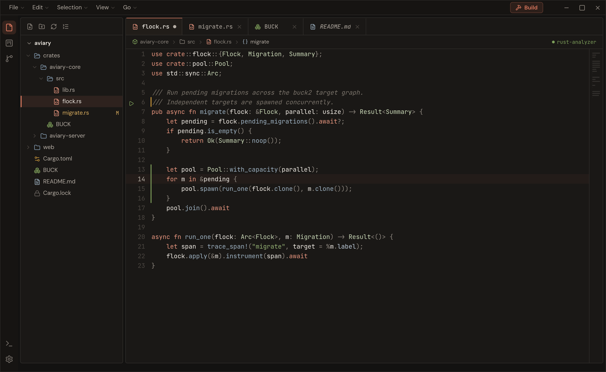
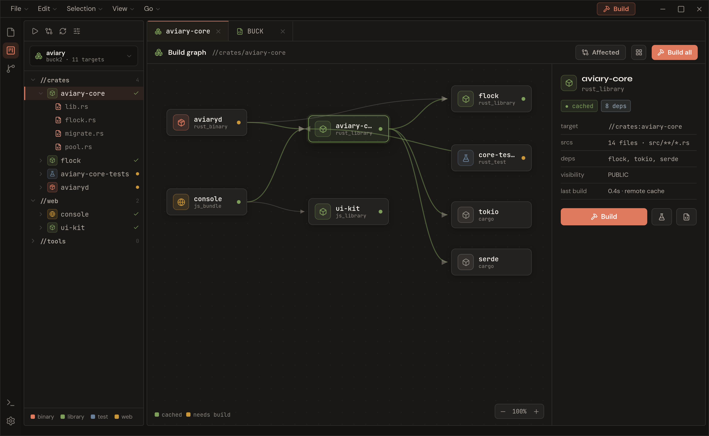

# What is this?

I'll start with I'm sorry, I have vibed most of this up. Why Rust? I'm in my Rust era, okay.

For years now I have been unable to satisfactorily explain something I really wanted.
Ever since I learned about [Bazel](https://bazel.build/) then [Buck2](https://buck2.build/) I wanted to use it. But my projects will never get big enough and if they do get that big it's already too late to switch.

My best way of trying to explain my idea is Visual Studio but with Bazel, then it became Visual Studio but with Buck2, eventually Visual Studio but with Starlark; and everyone I have tried to explain this to has said use VSCode, and it's just not what I want.

Maybe there is a way to get VSCode to behave the way I want, **but I don't know how. In fact I don't know enough to build large parts of this project.** I don't have a deep enough understanding of Starlark to build this right now, but AI can help me make parts of it and maybe someone who knows enough and wants to make it can look at it and understand.

If you want something from people who know what they are doing check out [Buildozer](https://github.com/bazelbuild/buildtools/blob/main/buildozer/README.md)

## Core Idea

At its core it's a template-based IDE, built around Bazel/Buck2. The user has a file like `.rules` or something that defines a few things.

LSP, linting, etc.

But also how to edit the Starlark files to add files, dependencies, and what rules to look for.

I'm currently imagining something like this.


```

rust:
    lsp: /*Left to your imagination right now*/
    lint: /*Left to your imagination right now*/
    lark:
        ident: "name"
        dep: "dep"
        src: "srcs"
            ext: "rs"
        binary: "rust_binary"
        library: "rust_library"

cc:
    lsp: /*Left to your imagination right now*/
    lint: /*Left to your imagination right now*/
    lark:
        ident: "name"
        dep: "deps"
        src: "srcs"
            ext:
            - "cc": "source"
            - "h": "header"
        hdr: "hdrs"
            ext: "h"
        binary: "cc_binary"
        library: "cc_library"

```
(I don't really think this will work in the long run, imports etc, but I don't know a good way of expressing it)

This would allow you in the UI to add new projects (folders) of type cc or rust, creating scaffolding for the project.

Ideally every language that Bazel or Buck2 supports should work, once again I don't know how.

The rules should be modular and I want it so bad to be distributable via GitHub.
Like "Oh I want to develop Java today" and `insert-username-here` has a nice structure I like so I will use their template.

Parts of this are "easy" — in skedit-cli there is a tool that can create and edit rules. Other stuff will be hard if not impossible, like handling includes in C or libraries in Rust where we need to parse the syntax and add dependencies.

The project view would be a major challenge since I would imagine a project as a folder.
But inside that folder there are targets, so you would have a file view and a solution/target view...

Like the test target would have its file dependencies and the binary target would have others, some of them exist in both.

And there might be a test, lib, and binary target in the same file...

And I haven't even gotten started on things like building container images with it like Google does with [distroless](https://github.com/googlecontainertools/distroless). And now you are thinking "this will never work, this is too complicated" and I agree with you. Making a code editor will be difficult enough.


### Issues I Want to Look At

* Can I communicate my idea in a good enough way?
* Can I build an editor?
* Can I create a template system that would be easy to share via GitHub?
* Can I have Bazel/Buck2 as a first class citizen in the editor?
* Can I make it easy to add and manage interproject dependencies?
* Can I make it easy to add remote dependencies? (Maven, crates, etc?)

* How do I communicate what files belong in what target?
* Will I finish this list before running off to something else?

### When i wish upon a star

I would want it to look something like this. I created a PenPot sketch then i gave that to Claude, then updated my design with stuff i liked from his output and then sent it back.
Claude seems obsessed with VScode because i had to remove VSCode-ish asspects again, again and again. 
I used some assets from another dream project, a code hosting site i call Bofink. 
So thats why it keeps doing the bird stuff. There might be some Bofink refrences left that i have missed. `<_<`

Did i mention it keeps creating VSCode.

*Things i dont like*
I wanted something like zeds row and character position and language in the bottom right but keeps ignoring it.


*Insperations* 
* [Obsidian](https://obsidian.md/)
* [Zed](https://zed.dev/)
* Jetbrains Rider
* [Halloy](https://github.com/squidowl/halloy)




